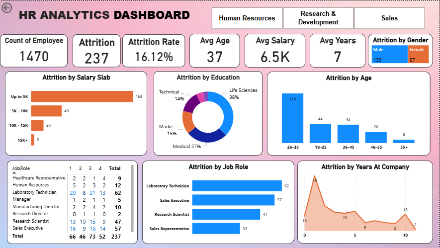

# HR Analytics Dashboard – Employee Attrition Analysis

## 📌 Project Overview
This HR Analytics project analyzes employee attrition to identify key factors contributing to workforce turnover. The interactive Power BI dashboard provides insights that help HR teams make data-driven decisions to improve employee retention.

## 🛠 Tools & Technologies
- Power BI  
- Excel / CSV Dataset  
- DAX (Calculated Columns & Measures)

## 📂 Dataset Description
The dataset contains employee-level information including:
- Employee ID
- Age
- Gender
- Department
- Job Role
- Education Field
- Monthly Salary
- Years at Company
- Attrition Status

## 🧹 Data Cleaning & Processing
- Removed duplicate employee records  
- Handled missing and inconsistent values  
- Created salary slabs (Up to 5K, 5K–10K, 10K–15K, 15K+)  
- Created calculated measures for Attrition Count, Attrition Rate, Average Age, Salary, and Years  
- Standardized categorical columns for accurate analysis  

## 📊 Key KPIs
- Total Employees: **1470**
- Attrition Count: **237**
- Attrition Rate: **16.12%**
- Average Age: **37**
- Average Salary: **6.5K**
- Average Years at Company: **7**

## 📈 Dashboard Features
- Attrition analysis by **Salary Slab**
- Attrition by **Age Group**
- Attrition by **Gender**
- Attrition by **Education Field**
- Attrition by **Job Role**
- Attrition trend by **Years at Company**
- Interactive department filters (HR, R&D, Sales)

## 🖼 Dashboard Preview

## 🔍 Key Insights
- Highest attrition observed in employees earning **up to 5K salary**
- Majority of attrition occurs in the **26–35 age group**
- **Male employees** show higher attrition compared to females
- Job roles such as **Laboratory Technician** and **Sales Executive** have higher attrition
- Employees with **0–3 years of experience** show the highest turnover

## ✅ Conclusion
The dashboard highlights critical attrition patterns across salary, age, job role, and experience. These insights can help HR teams design better retention strategies, improve workforce stability, and reduce hiring costs.

